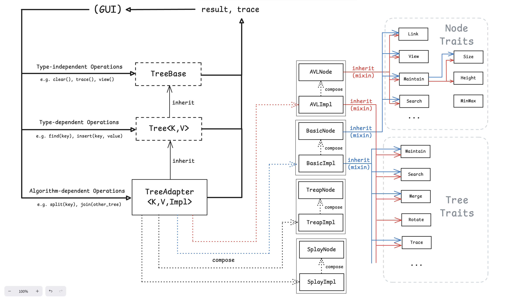
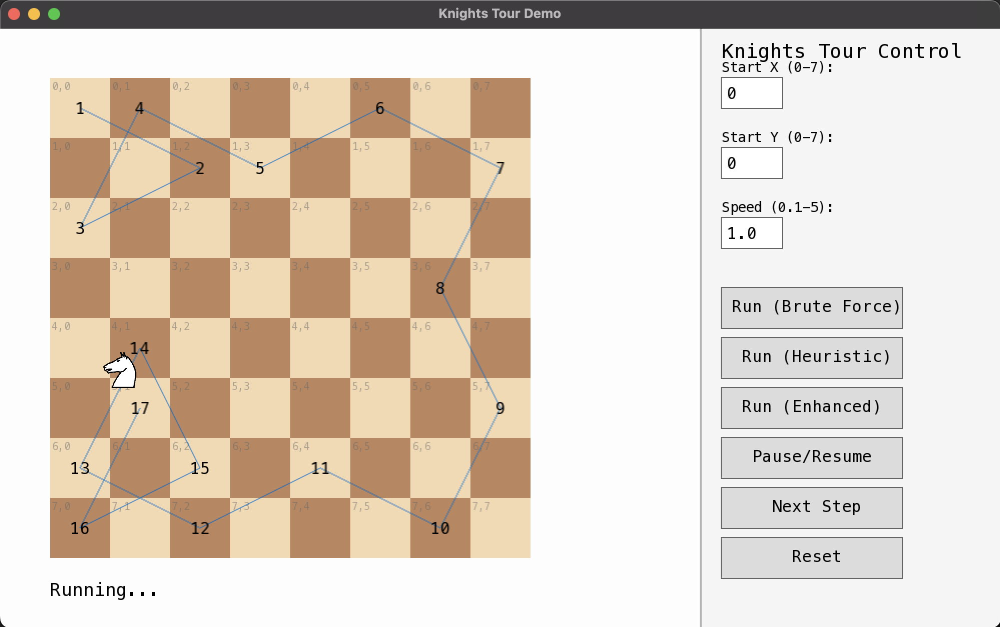
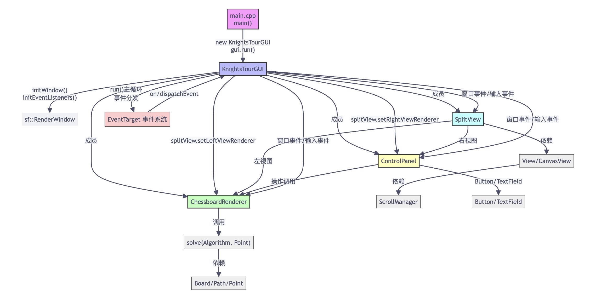

# UCAS 数据结构课程大作业

- 实习2.4 马踏棋盘问题演示
- 实习6.4 平衡二叉树操作演示

[汇报slide](report/slide.pdf)

[报告](report/report.pdf)

Build: `cmake -Bbuild && cmake --build build`

---

## Balanced Tree

---

## Knight's Tour Problem

