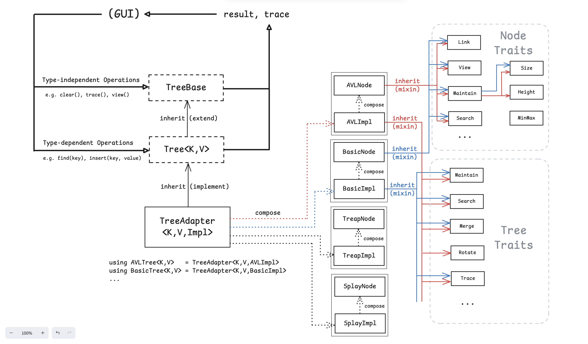

# Assignments for Data Structure Course

Build: `cmake -Bbuild && cmake --build build`

---

[Balanced Tree Visualizer](/balanced_tree/README.md)

---

[Knight's Tour Problem Visualizer](/knights_tour/README.md)
